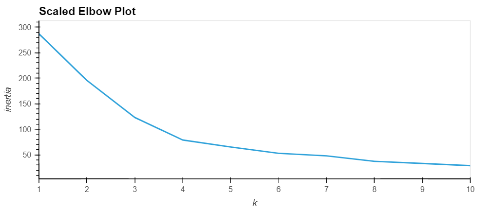
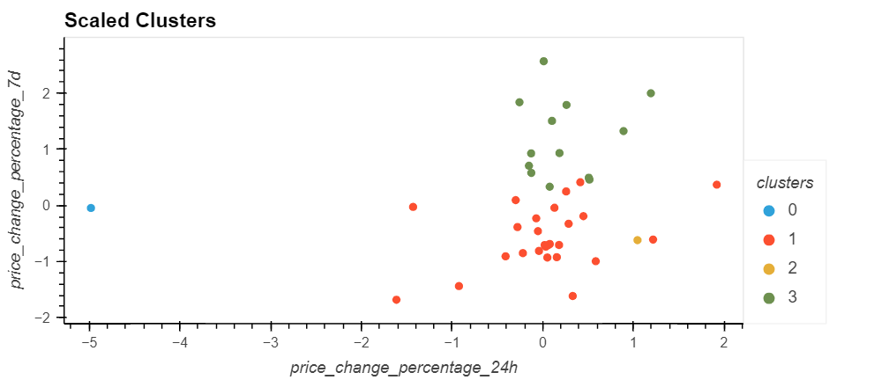
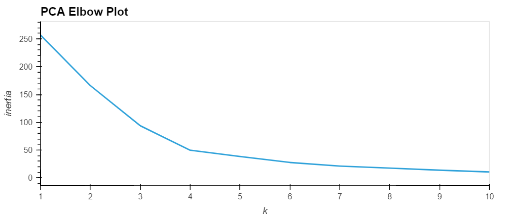
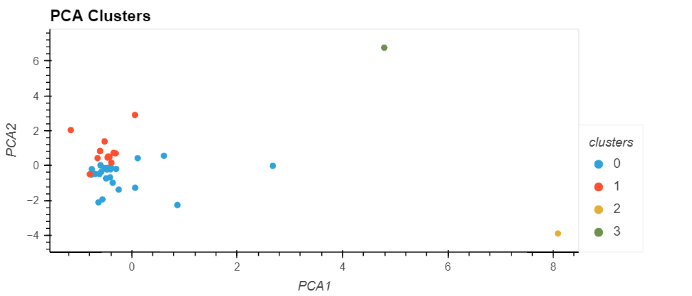

# CryptoClustering
- Using unsupervised learning to cluster cryptocurrency data
### - Overview
- Author: Vinny Shankar
- Acknowledgements:
    - Study Groups: worked together with several students to understand the assignment
    - Students: [Hany Dief](https://github.com/hanydief), [Jed Miller](https://github.com/Jed-Miller), [Jesús Jiménez](https://github.com/JesusJimenez3318), [Shridhar Kamat](https://github.com/shriparna), [Ajay Gopalkrishna](https://github.com/ajoyg)
    - Program: University of California Berkeley Data Analytics Bootcamp
    - Instructor: Ahmad Sweed
### - Description
* Part 1
    * Scale the given cryptocurrency dataset with StandardScaler
    * Find the best value for k (number of clusters) using the elbow method (Best value found: k=4)         
    
    * Use KMeans to cluster the scaled data (with the optimum k value found in the previous step)           
    
* Part 2
    * Use PCA to turn the original scaled dataset into a new DataFrame with 3 components
    * Find the best value for k (number of clusters) using the elbow method (Best value found: k=4)         
    
    * Use KMeans to cluster the scaled data (with the optimum k value found in the previous step)           
    
### - Conclusion
* Both elbow plots from Part 1 and Part 2 indicate the same value for k: 4.
* Using fewer features (Part 2) to cluster the data appears to produce tighter, more closely-related clusters when compared to having more features (Part 1).